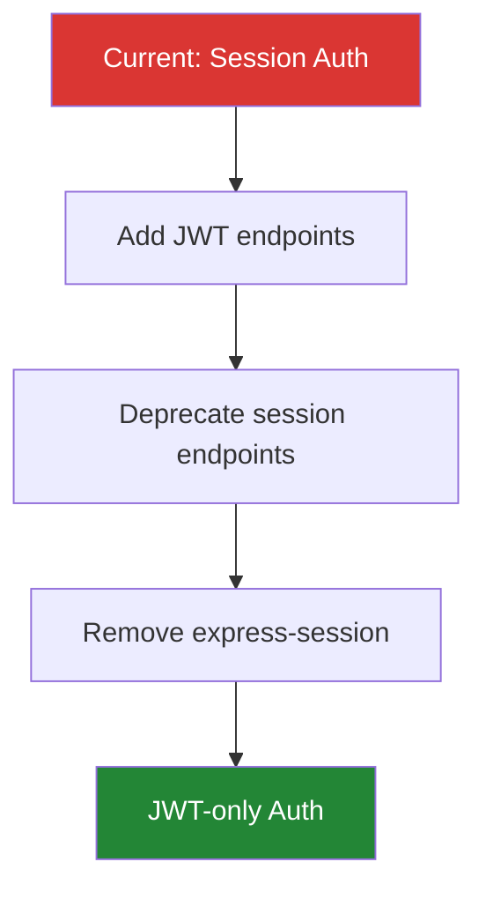

# Auth Refactor Plan

## Overview
Refactor the authentication layer to use JWT tokens instead of session cookies.
This improves horizontal scalability and simplifies the mobile client integration.

## Phase 1: Setup JWT Infrastructure

- Add `jsonwebtoken` dependency to package.json
- Create `src/auth/jwt.ts` with sign/verify utilities
- Add `JWT_SECRET` to `.env.example`

### JWT Token Structure

```typescript
interface JWTPayload {
  userId: string;
  email: string;
  role: 'admin' | 'user';
  iat: number;
  exp: number;
}

async function signToken(payload: Omit<JWTPayload, 'iat' | 'exp'>): Promise<string> {
  return jwt.sign(payload, process.env.JWT_SECRET!, { expiresIn: '7d' });
}
```

## Phase 2: Replace Session Middleware

Replace `express-session` with JWT validation middleware:

```typescript
export function jwtMiddleware(req: Request, res: Response, next: NextFunction) {
  const token = req.headers.authorization?.split(' ')[1];
  if (!token) return res.status(401).json({ error: 'Unauthorized' });
  
  try {
    const payload = jwt.verify(token, process.env.JWT_SECRET!) as JWTPayload;
    req.user = payload;
    next();
  } catch {
    res.status(401).json({ error: 'Invalid token' });
  }
}
```

## Phase 3: Migration Strategy



## Acceptance Criteria

| Criterion | Test |
|-----------|------|
| JWT sign/verify works | Unit tests pass |
| Protected routes reject invalid tokens | Integration tests |
| Mobile client can authenticate | E2E test |
| Session endpoints return 410 Gone | Migration test |

## Risk Assessment

> **Low Risk**: JWT library is well-tested. Session middleware removed incrementally.
> Rollback plan: feature flag `USE_JWT=false` reverts to sessions.
